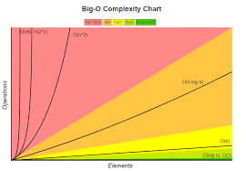

# 算法与数据结构学习笔记
>从广义上讲，数据结构就是一组数据的表示或存储结构,而算法就是操作数据的一组方法。数据结构与算法是相辅相成，数据结构为算法服务，算法作用在特定的数据结构上。数据结构应该针对应用场景而设计。

>

## 算法

### 算法复杂度
#### 时间复杂度
>事后统计法通过把代码跑一遍，对过程进行统计，监控得到算法执行的时间和占用内存等资源信息。但有很大局限，一个是比较依赖测试环境，其二结果受数据规模影响很大。
>大O复杂度表示法 T(n) = O(f(n)) T(n)表示代码执行时间， n表示数据规模，f(n)表示每行代码执行次数总和，公式中的O表示T(n) 与 f(n) 成正比, 也叫渐进时间复杂度
>>复杂度分析技巧
>>+ 关注执行次数最多的一段代码
>>+ 加法法则:总复杂度等于量级最大的那段代码的复杂度
>>+ 乘法法则:嵌套代码的复杂度等于嵌套内外代码复杂度乘积  
>>> 常见代码复杂度  
>>>  
>>> 代码复杂度分类  
>>>>+ 最坏时间复杂度表示代码执行最坏情况时间复杂度
>>>>+ 最好时间复杂度表示代码执行最理想时间复杂度
>>>>+ 平均时间复杂度把每种情况下代码执行次数累加再除以所有情况
>>>>+ 平均加权时间复杂度在平均时间复杂度的基础上考虑每种情况出现的概率，统计每种情况执行次数时乘以概率
>>>>+ 均摊时间复杂度是一种特殊场景的时间复杂度，如果最坏情况的时间复杂度可以均摊到最好情况的时间复杂度，可以使用均摊时间复杂度

#### 空间复杂度
>与时间复杂度类似，空间复杂度表示算法存储空间与数据规模增长关系
### 算法思想

#### 排序算法

#### 位算法

## 数据结构

### 线性表

#### 数组

##### 特点
+ 连续的内存空间和相同数据存储类型
+ 下标访问时间复杂度是O(1)
+ 插入操作如果数组有序，要保持有序复杂度是O(n)，无序只需移动一个元素，复杂度是O(1)
+ 删除操作，删除数组中间数据，也需要搬移数据，平均时间复杂度是O(n) (优化技巧，可以先记录删除的位置，在必要时一次性批量删除，提高效率)
+ 存储元素寻址公式a[i] = base_address + i * data_type_size(备注:数组索引从0开始)
+ 可以利用计算机存储的局部性优化原理

#### 链表

#### 堆栈

#### 队列

### 树

### 图

## 数学知识

### 等比数例

### 对数

## 参考
[算法](https://book.douban.com/subject/19952400/)  
[算法之道](https://book.douban.com/subject/4249686/)  
[计算机的心智操作系统之哲学原理](https://book.douban.com/subject/3670621/)  
思维导图来自来自极客时间数据结构与算法课程  

## 数学参考
[简单微积分](https://book.douban.com/subject/30271424/)
[离散数学及期应用](https://book.douban.com/subject/2130743/)
[程序员的数学3：线性代数](http://www.ituring.com.cn/book/1239)
[程序员的数学2：概率统计](http://www.ituring.com.cn/book/1254)
[具体数学：计算机科学基础](http://www.ituring.com.cn/book/932)