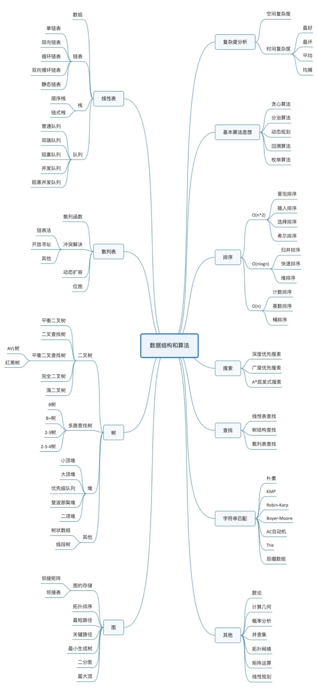

# 算法与数据结构学习笔记
>从广义上讲，数据结构就是一组数据的表示或存储结构,而算法就是操作数据的一组方法。数据结构与算法是相辅相成，数据结构为算法服务，算法作用在特定的数据结构上。数据结构应该针对应用场景而设计。

>

## 算法

### 算法复杂度分析

### 算法思想

#### 排序算法

#### 位算法

## 数据结构

### 线性表

#### 数组

#### 链表

#### 堆栈

#### 队列

### 树

### 图

## 数学知识

### 等比数例

### 对数

## 参考
[算法](https://book.douban.com/subject/19952400/)  
[算法之道](https://book.douban.com/subject/4249686/)  
[计算机的心智操作系统之哲学原理](https://book.douban.com/subject/3670621/)
思维导图来自来自极客时间数据结构与算法课程

